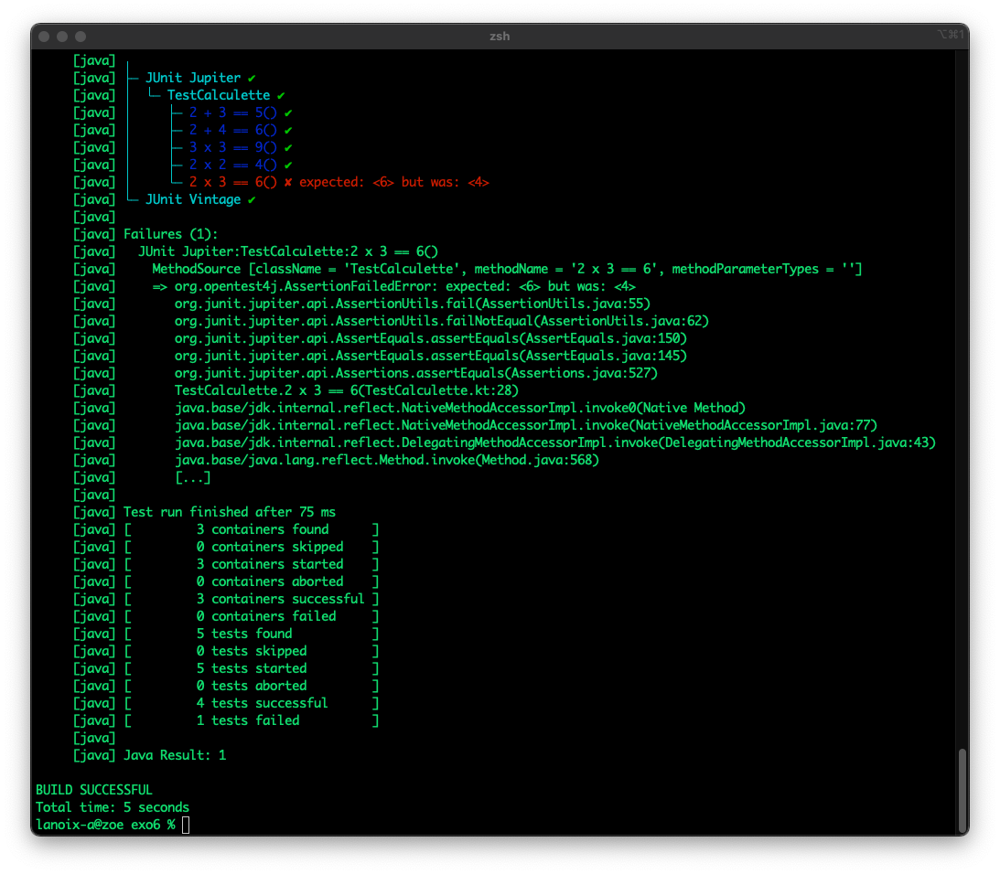

Comme on l'a vu dans l'exercice précédent,  les commandes de compilation/exécution deviennent vite **compliquée**

Pour faciliter ces tâches, on va utiliser un outil dédié : **ant** ; [Ant](https://fr.wikipedia.org/wiki/Apache_Ant) permet d'automatiser la compilation, la génération de documentation, la créantion de version distribuable, l'exécution de cas de tests, etc.

Si la commande `ant` n'est pas installée :

    sudo apt-get update
    sudo apt-get install ant

Pour fonctionner ant a uniquement besoin d'un fichier de configuration `build.xml` dans lequel on précisera les _tâches_ que Ant va réaliser.

Il y a déjà à la racine un fichier `build.xml` qui défini déjà plusieurs _tâches_ pour vous. Vous n'aurez pas à vous en préoccuper plus que cela.

```
ant clean
``` 
efface le dossier `bin` (= fichiers compilés).

```
ant build
``` 
compile tout le contenu du dossier `src` et produit un fichier `.jar`. Par défaut, le nom du .jar généré est `info1-main-YYYY-MM-DD.jar` mais c'est bien entendu  modifiable.

```
ant run
``` 
exécute le fichier `.jar`.

NB : les tâches ont des dépendances. Lancez la tâche `run`, lance automatiquement la tâche `build` avant.

Dans le fichier `local.properties` vous pouvez paramétrer les tâches ant. Par exemple, précisez un autre préfixe pour le nom du .jar généré.

_Avoir (et/ou écrire) des **cas de tests (unitaires)** pour valider son développement et une très bonne démarche de développement.
Vous aurez plus tard dans le semestre un module dédié au test logiciel dans lequel vous reviendrez sur la conception et l'écriture de cas de tests, etc. Pour le moment, nous serons principalement utilisateur de **cas de tests fournis** ; nous procéderons toujours ainsi dans la suite des TPs._

Ouvrez le fichier `test/TestCalculette.kt` ; c'est normalement assez facilement compréhensible.

```
ant test
``` 
va compiler le contenu du dossier `test` et exécuter les tests contenus.

Vous devriez obtenir un affichage dans la console similaire à celui-ci : 

La partie du haut vous indique que 4 des cas de tests se sont exécutés correctement et que le dernier à échouer. Vous avez ensuite la description détaillée de l'echec. 

Corrigez le fichier `src/Calculette.kt` et relancez les tests.

